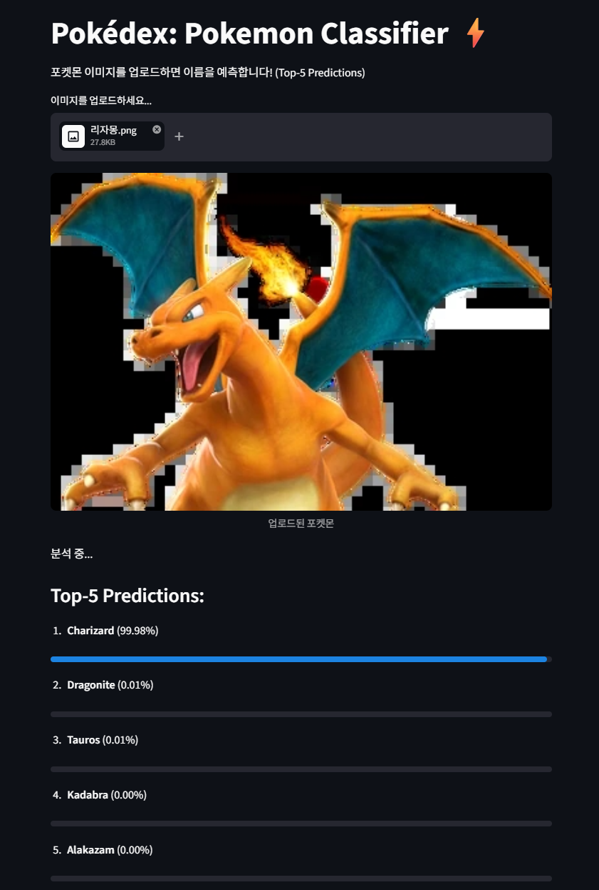

# ⚡ Pokemon Classifier: Transfer Learning Project

이 프로젝트는 딥러닝 전이 학습(Transfer Learning) 기술을 활용하여 1세대 포켓몬 150종을 높은 정확도로 분류하는 이미지 인식 시스템입니다. PyTorch 프레임워크를 기반으로 구축되었으며, 누구나 웹 브라우저에서 손쉽게 모델을 테스트할 수 있는 데모 환경을 제공합니다.

## 🛠️ 시스템 아키텍처 및 기능 설명 (Functional Description)

본 프로그램은 이미지 입력부터 최종 분류 결과 출력까지 다음과 같은 정교한 파이프라인을 거쳐 작동합니다.

### 1. 데이터 전처리 (Data Preprocessing)
입력된 이미지는 모델이 학습했던 데이터와 동일한 분포를 갖도록 변환됩니다.
- **Resize & Center Crop**: 모든 이미지는 224x224 픽셀 크기로 조정됩니다.
- **Normalization**: ImageNet 데이터셋의 평균(mean)과 표준편차(std)를 사용하여 정규화를 수행, 모델의 수렴 속도와 성능을 높였습니다.
- **Tensor Conversion**: 이미지를 모델이 계산 가능한 고차원 텐서(Tensor) 형태로 변환합니다.

### 2. 모델 설계 및 전이 학습 (Model & Transfer Learning)
성능 비교 실험을 통해 최적의 모델인 **ResNet18**을 최종 백본(Backbone)으로 선정했습니다.
- **Feature Extraction**: 사전 학습된(Pre-trained) ResNet18 가중치를 로드하여 이미지의 저수준 특징(선, 면, 색상 등)을 효과적으로 추출합니다.
- **Fine-tuning**: 하위 레이어의 가중치는 고정하지 않고 전체 네트워크를 미세 조정(Fine-tuning)하여, 포켓몬 데이터셋 특유의 기하학적 형태와 색상 패턴을 학습하도록 최적화했습니다.
- **FC Layer Replacement**: 기존 1,000개 클래스 출력층을 포켓몬 150종에 대응하는 출력층으로 교체했습니다.

### 3. 추론 및 시각화 (Inference & UI)
- **Softmax Probability**: 모델의 출력값에 Softmax 함수를 적용하여 150개 각 클래스에 대한 확률값을 도출합니다.
- **Top-5 Ranking**: 단순히 1순위 결과만 보여주는 것이 아니라, 확률이 높은 상위 5개의 포켓몬을 순위별로 정렬하여 신뢰도를 시각화합니다.
- **Streamlit Interface**: 파이썬 기반 웹 프레임워크를 통해 실시간 이미지 업로드 및 즉각적인 추론 결과 확인이 가능합니다.

## 🧪 실험 설정 및 성능 결과

| 실험 번호 | 모델 구조 | 가중치 사용 여부 | 학습 전략 | Accuracy | Precision | Recall |
| :--- | :--- | :---: | :--- | :---: | :---: | :---: |
| Exp 1 | ResNet18 | Pretrained | Feature Extractor (FC 전용) | 0.8189 | 0.8225 | 0.8174 |
| **Exp 2** | **ResNet18** | **Pretrained** | **Fine-tuning (전체 학습)** | **0.8761** | **0.8951** | **0.8743** |
| Exp 3 | VGG16 | Pretrained | Feature Extractor (Classifier 전용) | 0.4384 | 0.5366 | 0.4295 |
| Exp 4 | ResNet18 | Scratch | From Scratch (무작위 초기화) | 0.6034 | 0.6241 | 0.5981 |

